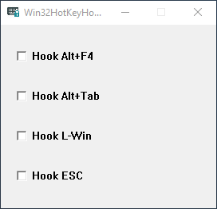

Win32HotKeyHookTool - which supports Alt+F4, "Alt+Tab", "L-Win", "ESC" at present  
  
> If the target program(such as FFXIV) is running as administrator, this "Win32HotKeyHookTool" should run as administrator as well.  
  
> If the target program(such as WOW) is **not** running as administrator, this "Win32HotKeyHookTool" need not to run as administrator as a consequence.
  
---     

Win32快捷键屏蔽工具 - 目前支持Alt+F4、Alt+Tab、左Win、ESC    
  
> 如果目标游戏程序（比如FFXIV）“以管理员身份运行”，那么本快捷键拦截程序也需要“以管理员身份运行”。  
    
> 如果目标游戏程序（比如WOW）并**没有**“以管理员身份运行”，那么本快捷键拦截程序也**不**需要”以管理员身份运行”。  
  
---  
  
  
